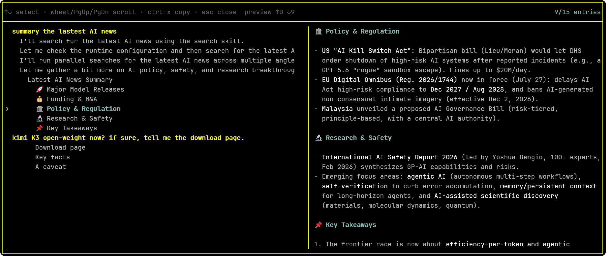

# pi-toc-outline

Interactive Markdown table-of-contents outline for [Pi](https://pi.dev) TUI.



## Why

Long Pi sessions accumulate many user messages and assistant responses with deeply nested Markdown headings. Scrolling through hundreds of lines to find a specific section is slow and distracting. This extension gives you a persistent, navigable outline — jump to any section instantly without touching the session timeline or the LLM context.

## Features

- **Zero timeline injection** — pure overlay, nothing is written to the session or sent to the LLM.
- Open with `/toc`, `/outline`, or `Alt+O`.
- Fixed-height overlay with a yellow framed border that never resizes as you navigate.
- Left panel: hierarchical outline.
  - User messages at level 1, orange-bold, flush left.
  - Assistant headings indented by depth: no-`#` text at level 2, 1-`#` at level 3, 2-`#` at level 4, etc.
- Right panel: live Markdown preview of the selected region, scrollable via mouse wheel and PgUp/PgDn.
- `Ctrl+X` copies the full selected Markdown to the system clipboard.
- Header shows current selection index (`3/15 entries`) and keyboard hints.

## Install

```bash
pi install git:github.com/v587d/pi-toc-outline@v1.0.0
```

Or via HTTPS:

```bash
pi install https://github.com/v587d/pi-toc-outline@v1.0.0
```

## Command

| Command | Description |
|---|---|
| `/toc` | Open the table-of-contents outline overlay |
| `/outline` | Alias for `/toc` |
| `Alt+O`  | Global shortcut to open the outline from anywhere |

## Usage

| Key | Action |
|---|---|
| `↑` / `↓` | Move selection (left panel) |
| `Wheel` / `PgUp` / `PgDn` | Scroll Markdown preview (right panel) |
| `Ctrl+X` | Copy selected Markdown to clipboard |
| `Esc` | Close |

## Security

This extension runs entirely within Pi's TUI process. It does **not**:

- make any network requests,
- read or write files outside the Pi session,
- execute shell commands,
- or access the system clipboard except when you explicitly press `Ctrl+X` to copy.

All outline data is derived from the current session's message entries, which are already in memory.

## License

MIT
