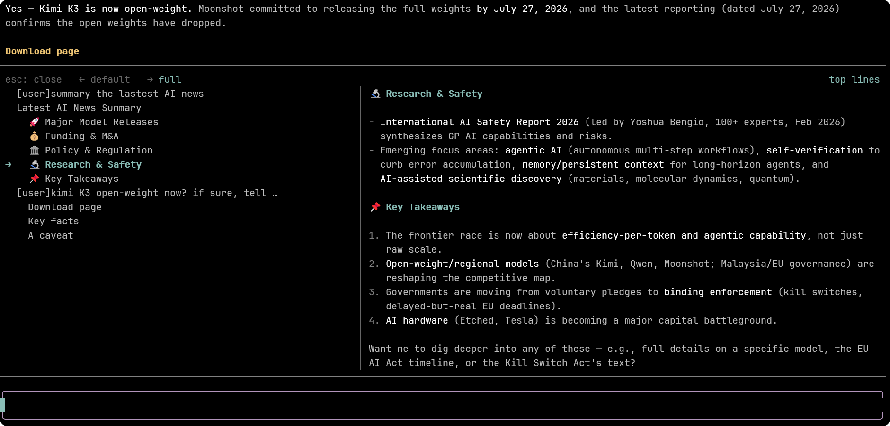

# pi-toc-outline

Interactive Markdown TOC outline for [Pi](https://pi.dev) TUI.



## Features

- **Zero timeline injection** — pure overlay, nothing is written to the session or sent to the LLM.
- Open with `/toc`, `/outline`, or `Alt+O`.
- Left panel: user messages as `[user]...` entries plus assistant headings indented by level.
- Right panel: live Markdown preview of the selected region.
- Two height modes: `default` and `full` (switch with `←` / `→`).

## Install

```bash
pi install git:github.com/v587d/pi-toc-outline@v1.0.0
```

Or with HTTPS:

```bash
pi install https://github.com/v587d/pi-toc-outline@v1.0.0
```

## Usage

| Key | Action |
|---|---|
| `Esc` | Close |
| `↑` / `↓` | Move selection |
| `←` | Default height |
| `→` | Full height |

## Zero Timeline Injection

This extension only renders a temporary overlay. It does **not**:

- append entries to the session,
- inject messages into the LLM context,
- modify system prompts,
- or persist any state.

## License

MIT
